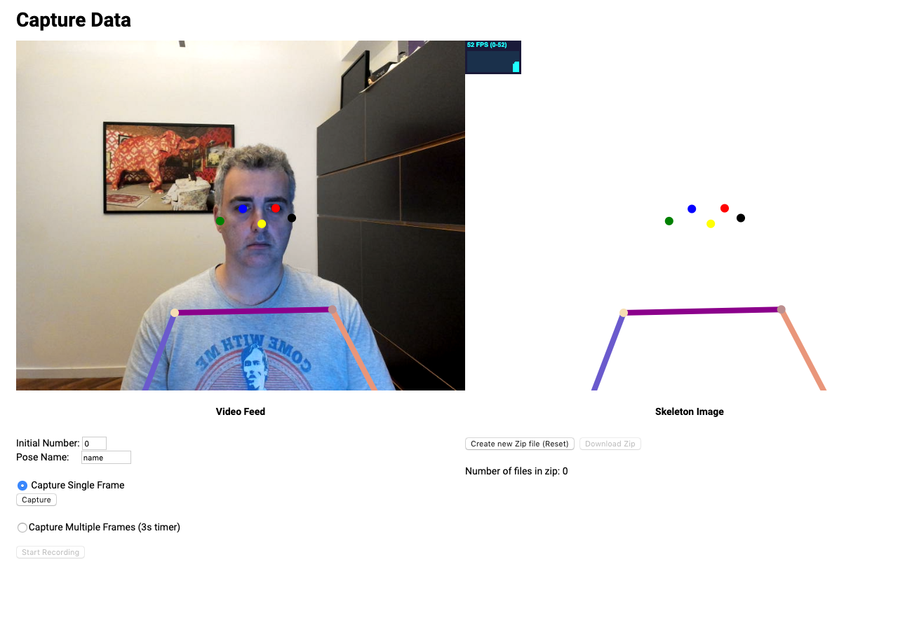

# Huia Experience - 01 Capturing Data

I created a Javascript app to capture images from the webcam. Instead of capturing the raw video feed, we are processing it with [TensorflowJS Posenet model](https://github.com/tensorflow/tfjs-models/tree/master/posenet) to do feature extraction in order to get the skeleton keypoints. We will be plotting these onto an image (on the right) and save it together with the keypoints in a json file. This data is going to be used to train our model for pose recognition.

# Learn more about this project

Read my [medium article](https://medium.com/@alessandrocauduro/creating-an-interactive-artificial-intelligence-experience-on-the-browser-with-tensorflow-ea205ee08c02) about this project to learn about all the details necessary to build an artificial intelligence experience on the browser from end-to-end.

# How to install and run

You will need [NodeJS](https://nodejs.org/) >= 8.9 and [Yarn](https://yarnpkg.com/) >=1.15 installed.


Go to the directory **/01_capture** and run the following commands.
``` bash
# change to this folder
$ cd 01_capture 

# install modules 
$ yarn

# start node server
# this will also open your browser on http://localhost:1234/
$ yarn watch   
```

# Capturing Data for Training



Everytime you click the **Capture** button, it will generate and save a PNG image of the current *Skeleton Image*. It uses the *Pose Name* and *Initial Number* to name it as: 
- **POSENAME_NUMBER.png**, e.g. fly_0.png

After you finishing capturing the images, you can download them by clicking on the **Download Zip** button. If you need to start from scratch, just click **Create New Zip file**.

I also included a timer feature that will take capture an image every 3 seconds until you tell it to stop. Just select the **Capture Multiple Frames** option. This is useful when you are alone and need to do self capturing of poses :-)

Everytime you capture an image, a thumbnail will show up with the file name. 

If you need to continue later, you can change the Initial Number, so that you don't have files with the same names.

# Zip File Structure

We save our captured images into the folder **/02_train/training_data** that will later be used to train our Neural Network model for pose detection.


For example, for the poses **jump** and **run** it would look something like this:
```
\training_data
    \images
        \jump_1.png
        \jump_2.png
        ...
        \run_1.png
        \run_2.png
        ...
    \json
        \jump_1.json
        \jump_2.json
        ...
        \jump_1.json
        \jump_2.json
        ...
        ... etc
```