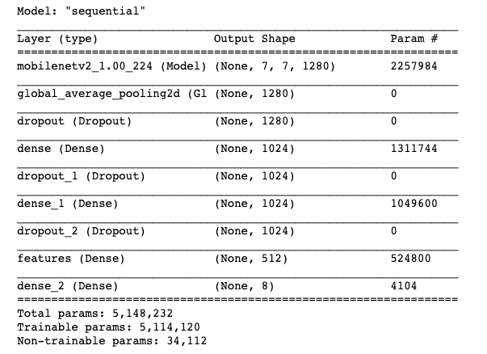

# Huia Experience - Training our Model

We will use the images in **02_train/training_data** created with our capture program to train our model.

# Learn more about this project

Read my [medium article](https://medium.com/@alessandrocauduro/creating-an-interactive-artificial-intelligence-experience-on-the-browser-with-tensorflow-ea205ee08c02) about this project to learn about all the details necessary to build an artificial intelligence experience on the browser from end-to-end.


# Setup 
You will need a virtual env with Python 3.7.

```bash
# change directory
$ cd 02_train

# install the necessary modules
$ pip install -r requirements.txt

# use jupyter notebook to train the model
$ jupyter notebook
```

# Model

This is our model architecture:




# Notebooks

## - train_huia_poses_keras_tf2.ipynb
We are using TF2/Keras to train our model, as it will be running on the browser with  TensorflowJS

## - train_huia_poses_fast_ai.ipynb
It is much simpler to have the same result with FASTAI, but converting it to run on the browser isn't so simple.

## - convert_fastai_tfsj.ipynb
Not working at the moment. I tried converting from the FASTAI model above in Pytorch to ONNX then to TFJS, but it isn't working.


# Copy final model to project

After we train our model, we can copy the TFJS model to **03_experience/static/** and update the **MODEL_HUIA_URL** variable in **03_experience/src/scripts/App.vue**